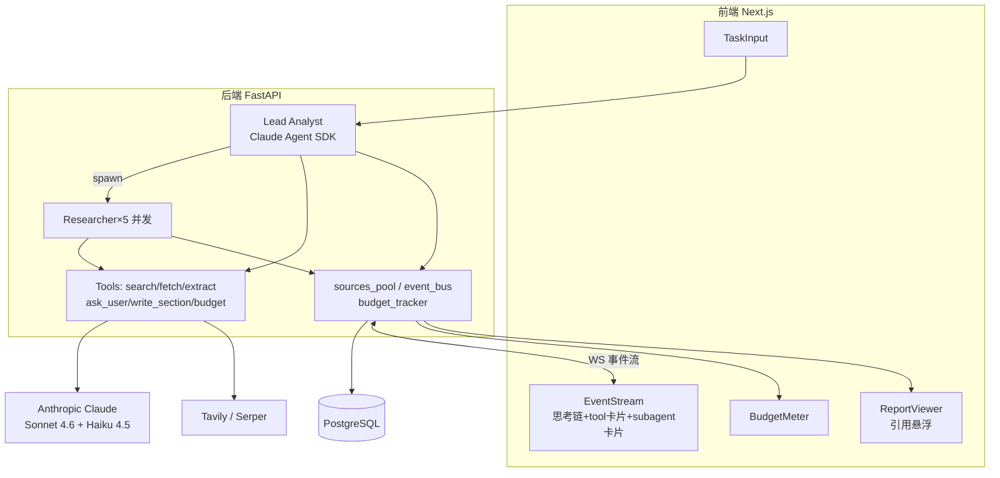
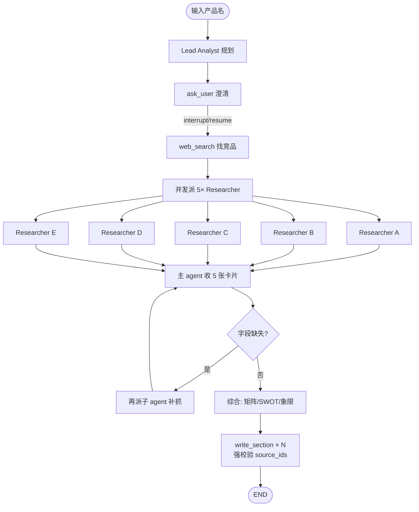
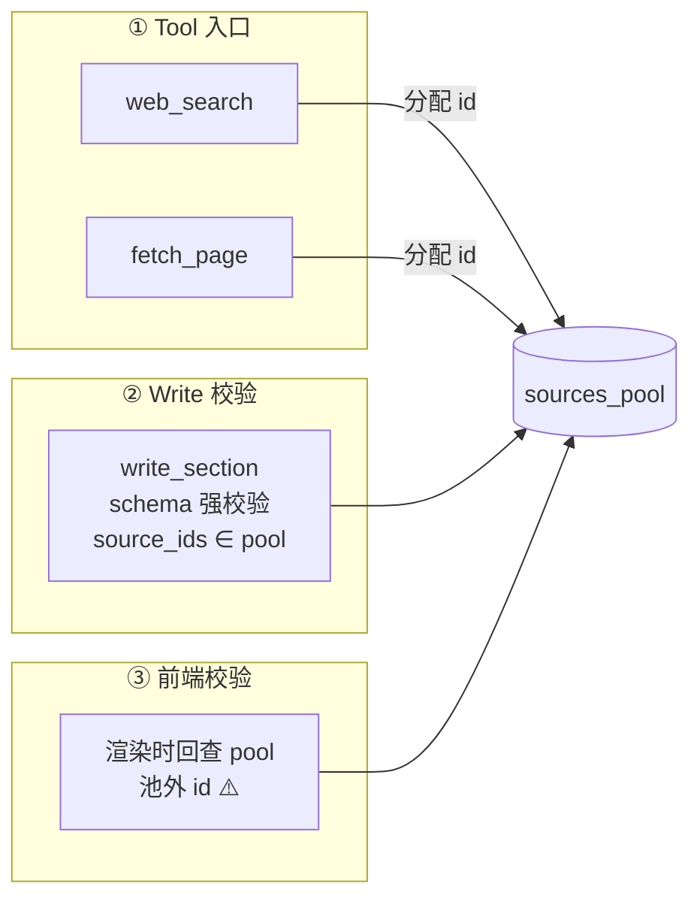
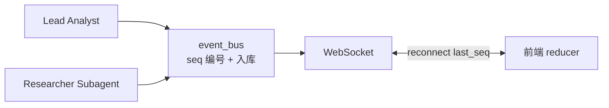
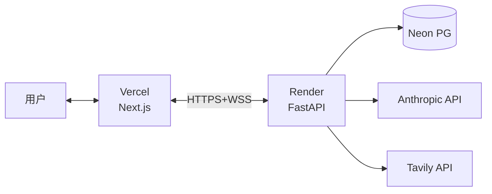

# 系统架构图

> 主 Agent + Tools + Subagent 架构。详细说明见 [CLAUDE.md](../CLAUDE.md)。

## 整体分层

## 主 Agent 执行流

重试由主 agent 看 tool error 自主决策，无质量门。

## 引用追踪三道防线

主 agent 写报告**只有 write_section 一条路径**。

## WS 事件流

事件类型：`text_delta` / `tool_use` / `tool_result` / `task_spawn` / `task_result` / `interrupt` / `resume` / `budget_update` / `done` / `failed`

## 部署

免费档够用，Demo 离线事件流回放兜底。
