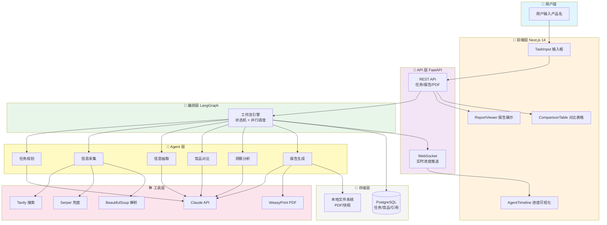
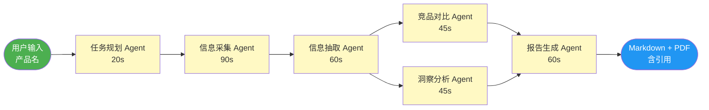
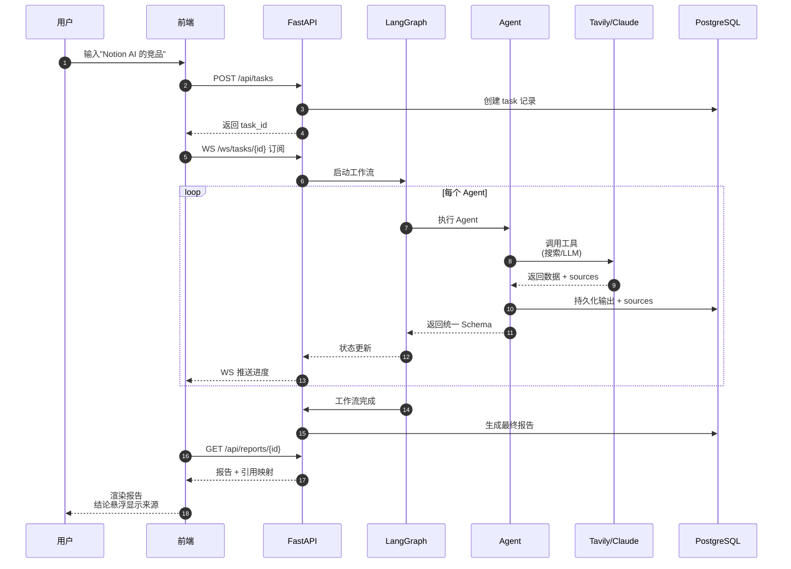
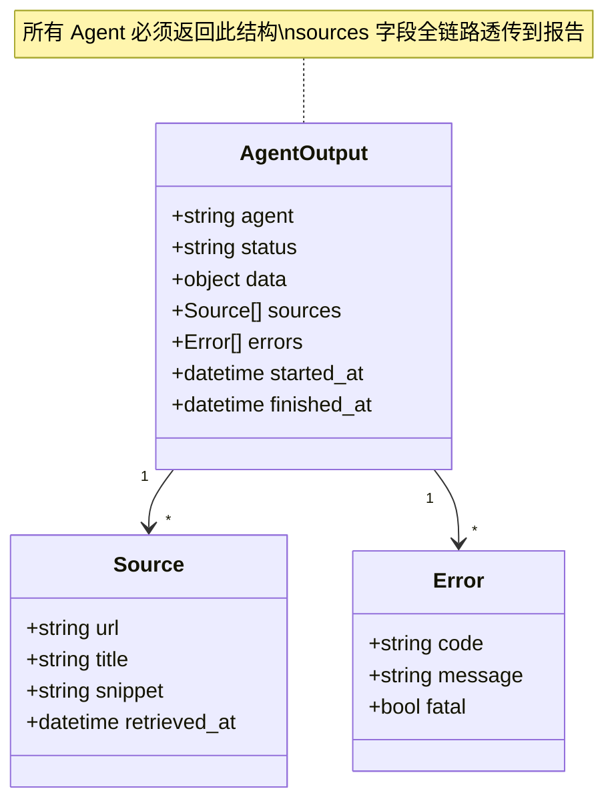
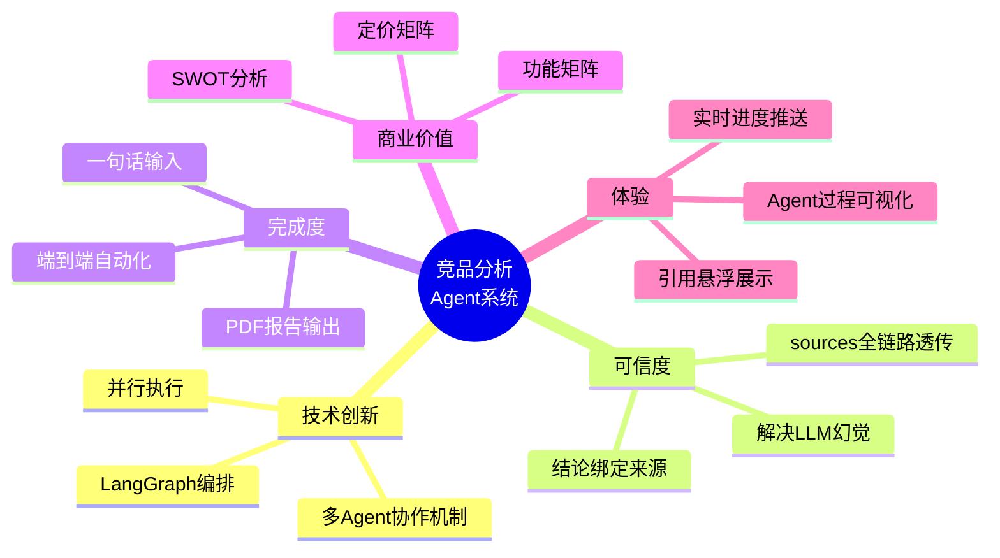
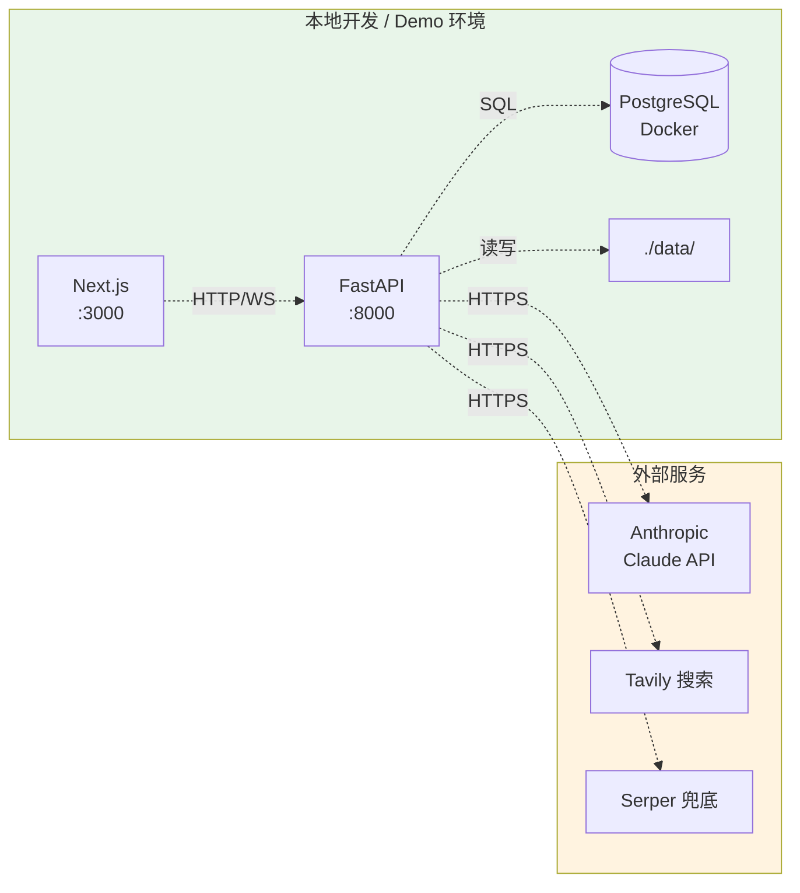

# 系统架构图

## 1. 整体分层架构

```mermaid
graph TB
    subgraph User["👤 用户层"]
        U[用户输入产品名]
    end

    subgraph Frontend["🎨 前端层 Next.js 14"]
        TI[TaskInput 输入框]
        AT[AgentTimeline 进度可视化]
        RV[ReportViewer 报告展示]
        CT[ComparisonTable 对比表格]
    end

    subgraph API["🔌 API 层 FastAPI"]
        REST[REST API<br/>任务/报告/PDF]
        WS[WebSocket<br/>实时进度推送]
    end

    subgraph Orchestration["🧠 编排层 LangGraph"]
        GRAPH[工作流引擎<br/>状态机 + 并行调度]
    end

    subgraph Agents["🤖 Agent 层"]
        A1[任务规划]
        A2[信息采集]
        A3[信息抽取]
        A4[竞品对比]
        A5[洞察分析]
        A6[报告生成]
    end

    subgraph Tools["🛠️ 工具层"]
        T1[Tavily 搜索]
        T2[Serper 兜底]
        T3[BeautifulSoup 解析]
        T4[Claude API]
        T5[WeasyPrint PDF]
    end

    subgraph Storage["💾 存储层"]
        DB[(PostgreSQL<br/>任务/竞品/引用)]
        FS[本地文件系统<br/>PDF/快照]
    end

    U --> TI
    TI --> REST
    REST --> GRAPH
    GRAPH --> A1
    GRAPH --> A2
    GRAPH --> A3
    GRAPH --> A4
    GRAPH --> A5
    GRAPH --> A6
    A1 --> T4
    A2 --> T1
    A2 --> T2
    A2 --> T3
    A3 --> T4
    A4 --> T4
    A5 --> T4
    A6 --> T4
    A6 --> T5
    GRAPH --> DB
    A6 --> FS
    GRAPH --> WS
    WS --> AT
    REST --> RV
    REST --> CT

    style User fill:#e1f5ff
    style Frontend fill:#fff3e0
    style API fill:#f3e5f5
    style Orchestration fill:#e8f5e9
    style Agents fill:#fff9c4
    style Tools fill:#fce4ec
    style Storage fill:#f5f5f5
```

---

## 2. Agent 工作流（执行时序）

```mermaid
flowchart LR
    START([用户输入<br/>产品名]) --> P[任务规划 Agent<br/>20s]
    P --> C[信息采集 Agent<br/>90s]
    C --> E[信息抽取 Agent<br/>60s]
    E --> COMP[竞品对比 Agent<br/>45s]
    E --> ANA[洞察分析 Agent<br/>45s]
    COMP --> R[报告生成 Agent<br/>60s]
    ANA --> R
    R --> END([Markdown + PDF<br/>含引用])

    style START fill:#4caf50,color:#fff
    style END fill:#2196f3,color:#fff
    style P fill:#fff9c4
    style C fill:#fff9c4
    style E fill:#fff9c4
    style COMP fill:#fff9c4
    style ANA fill:#fff9c4
    style R fill:#fff9c4
```

---

## 3. 数据流与引用追踪

```mermaid
sequenceDiagram
    autonumber
    participant U as 用户
    participant F as 前端
    participant API as FastAPI
    participant G as LangGraph
    participant A as Agent
    participant T as Tavily/Claude
    participant DB as PostgreSQL

    U->>F: 输入"Notion AI 的竞品"
    F->>API: POST /api/tasks
    API->>DB: 创建 task 记录
    API-->>F: 返回 task_id
    F->>API: WS /ws/tasks/{id} 订阅

    API->>G: 启动工作流
    loop 每个 Agent
        G->>A: 执行 Agent
        A->>T: 调用工具<br/>(搜索/LLM)
        T-->>A: 返回数据 + sources
        A->>DB: 持久化输出 + sources
        A-->>G: 返回统一 Schema
        G-->>API: 状态更新
        API-->>F: WS 推送进度
    end

    G->>API: 工作流完成
    API->>DB: 生成最终报告
    F->>API: GET /api/reports/{id}
    API-->>F: 报告 + 引用映射
    F-->>U: 渲染报告<br/>结论悬浮显示来源
```

---

## 4. Agent 统一输出 Schema

```mermaid
classDiagram
    class AgentOutput {
        +string agent
        +string status
        +object data
        +Source[] sources
        +Error[] errors
        +datetime started_at
        +datetime finished_at
    }

    class Source {
        +string url
        +string title
        +string snippet
        +datetime retrieved_at
    }

    class Error {
        +string code
        +string message
        +bool fatal
    }

    AgentOutput "1" --> "*" Source
    AgentOutput "1" --> "*" Error

    note for AgentOutput "所有 Agent 必须返回此结构\nsources 字段全链路透传到报告"
```

---

## 5. 创新点对照视图

```mermaid
mindmap
  root((竞品分析<br/>Agent系统))
    技术创新
      多Agent协作机制
      LangGraph编排
      并行执行
    可信度
      sources全链路透传
      结论绑定来源
      解决LLM幻觉
    完成度
      端到端自动化
      一句话输入
      PDF报告输出
    商业价值
      SWOT分析
      功能矩阵
      定价矩阵
    体验
      Agent过程可视化
      实时进度推送
      引用悬浮展示
```

---

## 6. 部署架构（简化版）

```mermaid
graph LR
    subgraph Local["本地开发 / Demo 环境"]
        FE[Next.js<br/>:3000]
        BE[FastAPI<br/>:8000]
        PG[(PostgreSQL<br/>Docker)]
        FS[./data/]
    end

    subgraph External["外部服务"]
        CLAUDE[Anthropic<br/>Claude API]
        TAVILY[Tavily 搜索]
        SERPER[Serper 兜底]
    end

    FE -.HTTP/WS.-> BE
    BE -.SQL.-> PG
    BE -.读写.-> FS
    BE -.HTTPS.-> CLAUDE
    BE -.HTTPS.-> TAVILY
    BE -.HTTPS.-> SERPER

    style Local fill:#e8f5e9
    style External fill:#fff3e0
```
