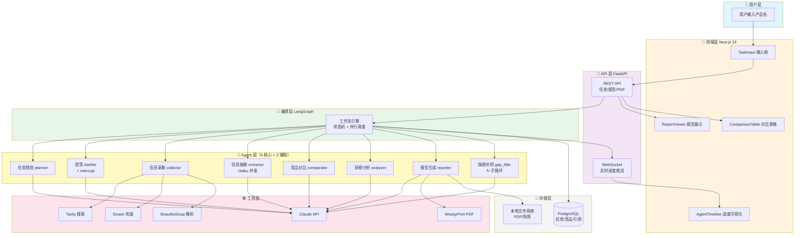
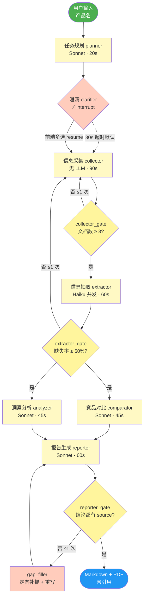
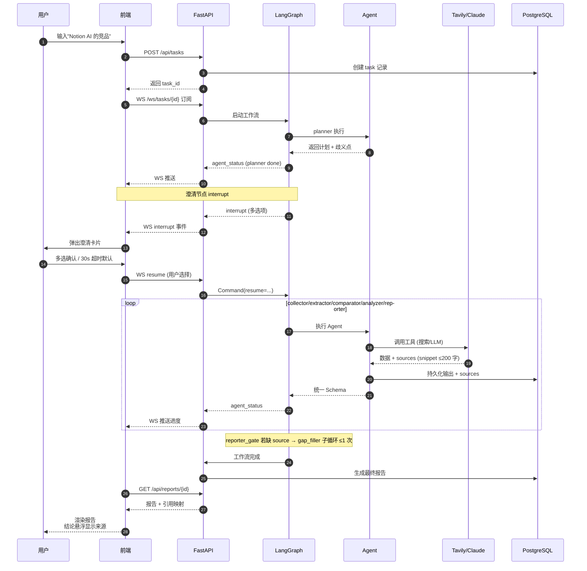
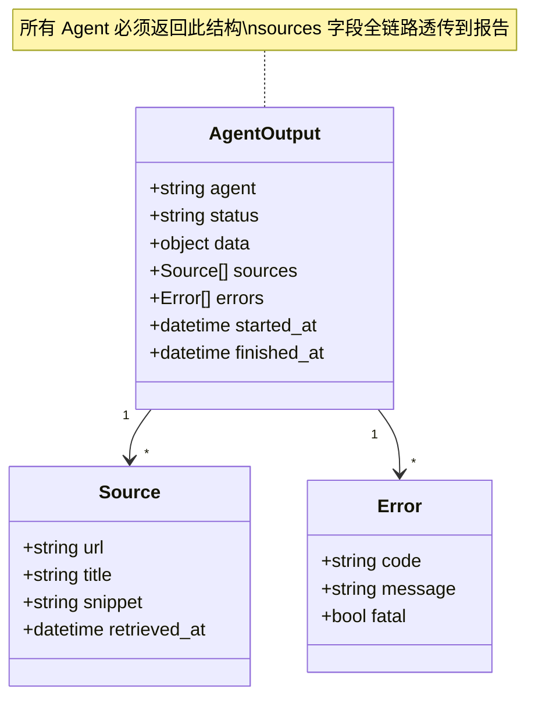
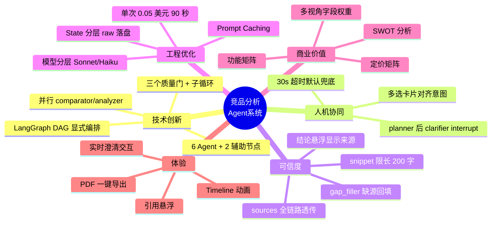
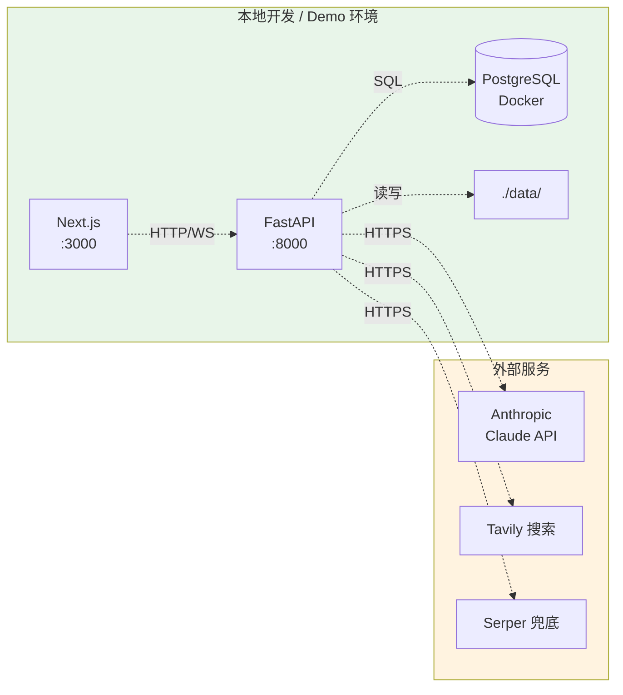

# 系统架构图

> 与 [v1-optimization-plan.md](./v1-optimization-plan.md) 保持同步。HTML 版 `architecture.html` 需在本文件改动后重新渲染。

## 1. 整体分层架构



---

## 2. Agent 工作流（DAG + 质量门 + 子循环）



> **预算**：happy path ≤ 90s / ≤ $0.05，硬超时 8 min（超时用已采集数据降级出简化报告）

---

## 3. 数据流与引用追踪



---

## 4. Agent 统一输出 Schema



---

## 5. 创新点对照视图



---

## 6. State 与上下文工程

```mermaid
graph LR
    subgraph State["AnalysisState（瘦身版，进 LangGraph）"]
        S1[product / clarifications]
        S2[plan_draft / competitors]
        S3[raw_doc_refs<br/>路径，不是内容]
        S4[structured 精简 JSON]
        S5[comparison / insights]
        S6[report_md]
        S7[sources<br/>snippet ≤ 200 字]
        S8[retries / quality_flags]
    end

    subgraph Disk["./data/snapshots/{task_id}/ (磁盘)"]
        D1[原始 HTML / Markdown]
        D2[抓取截图]
    end

    subgraph DB[("PostgreSQL")]
        T1[tasks 表]
        T2[sources 表]
        T3[reports 表]
    end

    S3 -. 引用路径 .-> D1
    S7 -. 落库 .-> T2
    S6 -. 落库 .-> T3
    S1 -. 落库 .-> T1

    style State fill:#e3f2fd
    style Disk fill:#f5f5f5
    style DB fill:#fff3e0
```

> **铁律**：>1K 的原始内容一律落盘，State 只存路径；每个 Agent 显式声明读哪些字段，不接受整 State。

---

## 7. 部署架构（简化版）


